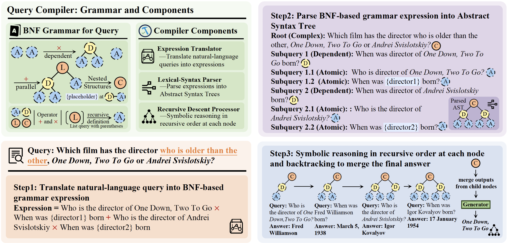

# <div align="center">QCompiler: Neuro-Symbolic Query Compiler</div>
<div align="center"> 

[](https://arxiv.org/abs/2505.11932)
[](https://huggingface.co/papers/2505.11932)
[](https://www.python.org/downloads/release/python-310/) 
[](https://opensource.org/licenses/MIT) 

</div>

<div align="left">
<a href="README.md">English</a> | <a href="README_zh.md">中文</a>
</div>

## 💡 Overview
### Introduction
The handling of complex user queries for Artificial Neural Networks (ANNs) presents a significant challenge: These queries often contain implicit intents, nested logical structures, and intricate dependencies, making it difficult to arrive at answers in a single step.

**QCompiler** framework aims to replicate the synergy of **neural computation** and **symbolic reasoning** found in the human brain to effectively address these complex queries in real-world scenarios. It parses complex queries into **Abstract Syntax Trees (ASTs)**, capturing their nested structures and dependencies, leading to more precise retrieval and generation in RAG systems.


<div align="center">

</div>

## ✨ Key Features

* 🎯 **Precise Search Intent Recognition:** QCompiler addresses the challenge of accurately interpreting complex queries with nested structures and dependencies in RAG systems.
   
* 🧠 **Neuro-Symbolic Framework:** Inspired by linguistic grammar rules and compiler design, QCompiler bridges the gap between neural networks and symbolic reasoning to effectively process complex queries.
   
* 📜 **Backus-Naur Form (BNF) Grammar:** A minimal yet sufficient BNF grammar  is designed to formalize complex queries, ensuring completeness and minimizing redundancy.
   
* ⚙️ **Query Compilation:** QCompiler includes a Query Expression Translator, a Lexical-Syntax Parser, and a Recursive Descent Processor to compile queries into Abstract Syntax Trees (ASTs) for execution.
   
* 🚀 **Improved RAG Systems:** QCompiler can improve RAG systems in multiple ways:
    * The atomicity of the sub-queries in the leaf nodes enables **more accurate document retrieval and response generation**.
    * The identified sub-queries without dependency can be executed in parallel, therefore **reducing the delay and improving the throughput of the RAG systems**.
    * In practical deployment scenarios, developers can even design extensive post-processing logic to refine the AST compiled by QCompiler.

## 🗺️ RoadMap

- [x] Release the implementation code of Abstract Syntax Tree Node Class, Query Expression Translator, Lexical-Syntax Parser and Recursive Descent Processor.
- [x] Release the pretrained checkpoint of our pre-trained language model for query expression translation. 
- [ ] Release the training script of QCompiler.
- [ ] Release the evaluation script of QCompiler in our paper.
- [ ] Release the pipeline of building training set for the experiments presented in our paper.


## 🛠️ Installation

### For Basic Usage
For basic usage of QCompiler, you can run the folling scripts to install the dependent packages:
```bash
pip install -r requirements.txt
pip install -e .
```

### For Domain-Specific Fine-tuning (Optional)
For training purposes, please additionally install the `Llama-Factory` framework by following the instructions in the [official repository](https://github.com/hiyouga/LLaMA-Factory):

```bash
git clone --depth 1 https://github.com/hiyouga/LLaMA-Factory.git
cd LLaMA-Factory
pip install -e ".[torch,metrics]"
```

## 🚀 Quick Start

### Basic Usage

#### 1. API Service Deployment
You can access our pre-trained model from [huggingface](https://huggingface.co/KeriaZhang/QCompiler-Llama3.2-3B).

To deploy the API service of our pre-trained QCompiler, please set the CUDA visible devices and start the service using the example command below in your terminal:

```bash
CUDA_VISIBLE_DEVICES=0,1 vllm serve /path/to/fine-tuned/model --port 8000 --tensor-parallel-size 2 --gpu_memory_utilization 0.7
```

This command will start the API service on port `8000` using 2 GPUs with 70% memory utilization. 

For more advanced usage, please refer to the vllm documentation.

#### 2. Usage of Query Expression Translator
You can use the Query Expression Translator with the following example code:
```python
from components import Translator, Parser

# Initialize OpenAI client
client = OpenAI(
    base_url = "http://localhost:8000/v1",
    api_key = "empty"
)

# Initialize Query Expression Translator
translator = Translator(
    client = client,
    model_name = "/path/to/your/deployed/fine-tuned/model"
)

# Translate Expression into BNF-Expression
expression = await translator.translate(
    query = "what is the citation number of ACL best paper 2025"
)
print(expression)

# What is the title of the ACL best paper in 2025 * What is the citation number of {paper}

expression = await translator.translate(
    query = "What are the best papers of ACL from 2020-2024"
)
print(expression)

# What are the best papers of ACL in 2020 + What are the best papers of ACL in 2021 + What are the best papers of ACL in 2022 + What are the best papers of ACL in 2023 + What are the best papers of ACL in 2024
```

#### 3. Usage of Lexical-Syntax Parser
You can use the Lexical-Syntax Parser with the following example code:

```python
parser = Parser()
print(parser.parse_complex_query(expression))
```

The two examples above will be parsed into the Abstract Syntax Trees as:

```bash
ListQuery(value='What is the best paper of ACL 2025 * What is the citation number of {best paper}', [
    DependentQuery(value='What is the best paper of ACL 2025 * What is the citation number of {best paper}', [
        AtomicQuery(value='What is the best paper of ACL 2025'),
        AtomicQuery(value='What is the citation number of {best_paper}', placeholder=['best_paper'])
    ])
])
```

```bash
ListQuery(value='What are the best papers of ACL in 2020 + What are the best papers of ACL in 2021 + What are the best papers of ACL in 2022 + What are the best papers of ACL in 2023 + What are the best papers of ACL in 2024', [
    AtomicQuery(value='What are the best papers of ACL in 2020'),
    AtomicQuery(value='What are the best papers of ACL in 2021'),
    AtomicQuery(value='What are the best papers of ACL in 2022'),
    AtomicQuery(value='What are the best papers of ACL in 2023'),
    AtomicQuery(value='What are the best papers of ACL in 2024')
])
```

You can use the `get_letter_expression` method to get the letter-format expression of original query for analysis:
```python
letter_expression, letter_mapping = parser.get_letter_expression(ast)
print(letter_expression)

# A + B + C + D + E

print(letter_mapping)

# {'A': 'What are the top papers of ACL in 2020', 'B': 'What are the top papers of ACL in 2021', 'C': 'What are the top papers of ACL in 2022', 'D': 'What are the top papers of ACL in 2023', 'E': 'What are the top papers of ACL in 2024'}
```

#### 4. Usage of Recursive Descent Processor
You can use the Recursive Descent Processor with the following example code:
```python
from components import RecursiveDescentProcessor
from flashrag.utils import get_retriever
from openai import OpenAI

client = OpenAI(
    base_url = "...",
    api_key = "..."
)

retriever = get_retriever(retriever_config)

processor = RecursiveDescentProcessor(
    retriever = retriever,
    client = client,
    model_name = "Qwen/Qwen2.5-7B-Instruct"
)
```
**Note**: In this example, we use the retriever class implemented by [FlashRAG framework](https://github.com/RUC-NLPIR/FlashRAG). You should first learn some usages of this framework before using Recursive Descent Processor.

> Due to the experimental Settings, the Recursive Descent Processor processes the sub-queries of leaf nodes in the order of the Depth-First earch strategy, which is sequential. You can develop new code to process List Queries in parallel.

## 📚 Training

Before training, please prepare the instruction-tuning datasets in JSON format. We use the `Llama-Factory` framework for training the QCompiler.

The training script is coming soon.

## 📊 Evaluation

We use the [FlashRAG framework](https://github.com/RUC-NLPIR/FlashRAG) for RAG task evaluation. Required files:

- Evaluation dataset (recommended to obtain from FlashRAG's [official repository](https://huggingface.co/datasets/RUC-NLPIR/FlashRAG_datasets))
- Model paths (same as above)
- The codes are coming soon.

## 📄 Citation

If you find this work helpful, please cite our paper:
```bibtex
@misc{zhang2025neurosymbolicquerycompiler,
      title={Neuro-Symbolic Query Compiler}, 
      author={Yuyao Zhang and Zhicheng Dou and Xiaoxi Li and Jiajie Jin and Yongkang Wu and Zhonghua Li and Qi Ye and Ji-Rong Wen},
      year={2025},
      eprint={2505.11932},
      archivePrefix={arXiv},
      primaryClass={cs.CL},
      url={https://arxiv.org/abs/2505.11932}, 
}
```

## 📄 License

This project is released under the [MIT License](LICENSE).

## 📞 Contact

For any questions or feedback, please reach out to us at [2020201710@ruc.edu.cn](2020201710@ruc.edu.cn).