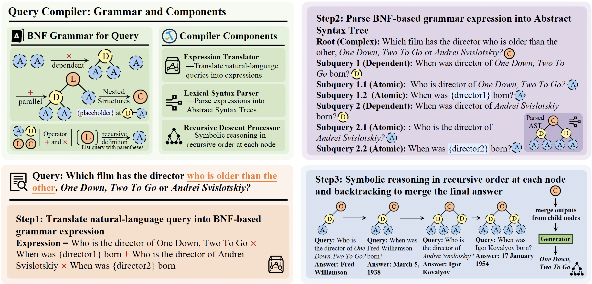

# <div align="center">QCompiler：神经符号查询编译器</div>

<div align="center"> 

[](https://arxiv.org/abs/2505.11932)
[](https://huggingface.co/papers/2505.11932)
[](https://www.python.org/downloads/release/python-310/) 
[](https://opensource.org/licenses/MIT) 

</div>

<div align="left">
<a href="README.md">English</a> | <a href="README_zh.md">中文</a>
</div>

## 💡 概述  

### 引言
人工神经网络（ANNs）在处理复杂用户查询时面临重大挑战：这类查询通常包含隐含意图、嵌套逻辑结构和复杂依赖关系，难以通过单一步骤得出答案。  

**QCompiler**旨在模仿人类大脑中**神经计算**与**符号推理**的协同作用，有效解决现实场景中的复杂查询问题。它将复杂查询解析为**抽象语法树（AST）**，捕捉其嵌套结构和依赖关系，从而在RAG系统中实现更精准的检索与生成。  


<div align="center">

</div>

## ✨ 核心特性  
* 🎯 **精准搜索意图识别**：QCompiler解决了RAG系统中准确解析具有嵌套结构和依赖关系的复杂查询的难题。  
* 🧠 **神经符号框架**：受语言语法规则和编译器设计启发，QCompiler架起神经网络与符号推理的桥梁，高效处理复杂查询。  
* 📜 **巴科斯-诺尔范式（BNF）语法**：设计了简洁且充分的BNF语法，用于形式化复杂查询，确保完整性并减少冗余。  
* ⚙️ **查询编译流程**：包含查询表达式翻译器、词法语法解析器和递归下降处理器，将查询编译为抽象语法树（AST）以执行。  
* 🚀 **增强RAG系统**：  
  - 叶节点中子查询的原子性支持**更精准的文档检索和响应生成**。  
  - 无依赖的子查询可并行执行，**降低延迟并提升RAG系统吞吐量**。  
  - 开发人员可设计后处理逻辑，优化QCompiler生成的AST。  


## 🗺️ 路线图  
- [x] 发布抽象语法树节点类、查询表达式翻译器、词法语法解析器和递归下降处理器的实现代码。  
- [x] 发布用于查询表达式翻译的预训练语言模型 checkpoint。  
- [ ] 发布QCompiler训练脚本。  
- [ ] 发布论文中的评估脚本。  
- [ ] 发布论文实验中训练集构建流程。  


## 🛠️ 安装指南  
### 基础使用  
执行以下命令安装依赖包：  
```bash  
pip install -r requirements.txt  
pip install -e .  
```  

### 领域特定微调（可选）  
如需训练，请额外安装`Llama-Factory`框架（遵循[官方仓库](https://github.com/hiyouga/LLaMA-Factory)指引）：  
```bash  
git clone --depth 1 https://github.com/hiyouga/LLaMA-Factory.git  
cd LLaMA-Factory  
pip install -e ".[torch,metrics]"  
```  


## 🚀 快速上手  
### 基础使用  
#### 1. API服务部署  
您可以从 [Hugging Face](https://huggingface.co/KeriaZhang/QCompiler-Llama3.2-3B) 获取我们针对多跳问题基准训练得到的预训练模型。  

请在终端中设置CUDA可见设备并启动服务（示例命令）：  
```bash  
CUDA_VISIBLE_DEVICES=0,1 vllm serve /path/to/fine-tuned/model --port 8000 --tensor-parallel-size 2 --gpu_memory_utilization 0.7  
```  
该命令将使用2块GPU（70%内存利用率）在端口`8000`启动API服务。  

#### 2. 查询表达式翻译器用法  
示例代码：  
```python  
from components import Translator, Parser  
import asyncio  

# 初始化OpenAI客户端（指向本地API服务）  
client = OpenAI(  
    base_url="http://localhost:8000/v1",  
    api_key="empty"  
)  

# 初始化翻译器  
translator = Translator(client=client, model_name="/path/to/your/model")  

# 翻译查询为BNF表达式  
async def example():  
    query1 = "2025年ACL最佳论文的被引次数是多少"  
    expr1 = await translator.translate(query=query1)  
    print(expr1)  
    # 输出：What is the best paper of ACL 2025 * What is the citation number of {best_paper}  

    query2 = "2020-2024年ACL的最佳论文有哪些"  
    expr2 = await translator.translate(query=query2)  
    print(expr2)  
    # 输出：What are the best papers of ACL in 2020 + What are the best papers of ACL in 2021 + ... + 2024  

asyncio.run(example())  
```  

#### 3. 词法语法解析器用法  
```python  
parser = Parser()  
ast1 = parser.parse_complex_query(expr1)  
ast2 = parser.parse_complex_query(expr2)  
```  
上述示例将被解析为以下抽象语法树：  
```bash  
# 第一个查询的AST（含依赖关系）  
ListQuery(  
    DependentQuery(  
        AtomicQuery("What is the best paper of ACL 2025"),  
        AtomicQuery("What is the citation number of {best_paper}", placeholder=["best_paper"])  
    )  
)  

# 第二个查询的AST（并行子查询）  
ListQuery(  
    AtomicQuery("2020年最佳论文"),  
    AtomicQuery("2021年最佳论文"),  
    ...,  
    AtomicQuery("2024年最佳论文")  
)  
```  
可通过`get_letter_expression`方法生成字母化表达式（便于分析）：  
```python  
letter_expr, mapping = parser.get_letter_expression(ast2)  
print(letter_expr)  # A + B + C + D + E  
print(mapping)       # {'A': '2020年...', 'B': '2021年...', ...}  
```  

#### 4. 递归下降处理器用法  
```python  
from components import RecursiveDescentProcessor  
from flashrag.utils import get_retriever  
from openai import OpenAI  

client = OpenAI(base_url="...", api_key="...")  
retriever = get_retriever(retriever_config)  # FlashRAG检索器  

processor = RecursiveDescentProcessor(  
    retriever=retriever,  
    client=client,  
    model_name="Qwen/Qwen2.5-7B-Instruct"  
)  
```  
**注**：在这个例子中，我们使用的是由 [FlashRAG](https://github.com/RUC-NLPIR/FlashRAG) 实现的检索器类。您应该首先学习使用这个框架的一些用法。

> 递归下降处理器通过深度优先搜索（DFS）顺序执行AST中的子查询，利用符号推理处理依赖关系（如用前一步结果填充占位符`{book}`），并合并结果生成最终答案。  


## 📚 训练
训练前请准备JSON格式的指令调优数据集，我们基于`Llama-Factory`框架进行训练。  
**训练脚本即将发布**。  


## 📊 评估
我们使用[FlashRAG框架](https://github.com/RUC-NLPIR/FlashRAG)进行RAG任务评估，所需文件：  
- 评估数据集（建议从FlashRAG[官方仓库](https://huggingface.co/datasets/RUC-NLPIR/FlashRAG_datasets)获取）  
- 模型路径（同上）  

**评估代码即将发布**。